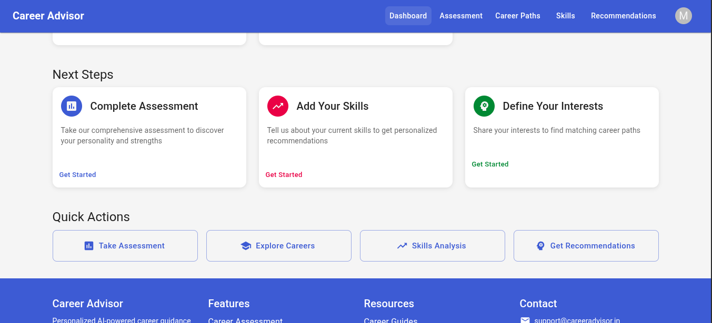

# 🎯 Personalized Career Advisor

An AI-powered personalized career and skills advisor platform designed specifically for Indian students. This application provides intelligent career guidance, skills assessment, and personalized recommendations to help students make informed career decisions.

## 🌟 Features

### 🎓 Core Functionality
- **AI-Powered Career Assessment**: Comprehensive evaluation of personality, skills, interests, and aptitudes
- **Personalized Recommendations**: Tailored career path suggestions based on individual profiles
- **Skills Gap Analysis**: Identify skill gaps and provide personalized learning paths
- **Real-time Career Insights**: Up-to-date information about job market trends in India
- **User Registration & Profile Management**: Secure user accounts with detailed profiles

### 🚀 Technical Features
- **Modern React Frontend**: Built with Material-UI for beautiful, responsive design
- **Node.js Backend**: RESTful API with Express.js
- **MongoDB Database**: Secure data storage and management
- **JWT Authentication**: Secure user authentication and authorization
- **Google Cloud AI Integration**: Advanced AI recommendations (optional)
- **Docker Support**: Easy deployment with Docker containers

## 📱 Screenshots

### Home Page

*Welcome to Personalized Career Advisor - Your AI-powered career guidance platform*

### Assessment Interface

*Comprehensive skills and personality assessment interface*

### Dashboard

*Personalized dashboard with career recommendations and progress tracking*

### About Page

*Learn more about our mission, team, and contact information*

### Registration

*User registration form with detailed profile creation*

### Career Recommendations

*AI-powered career path recommendations based on your profile*

## 🛠️ Technology Stack

### Frontend
- **React.js 18** - Modern UI framework
- **Material-UI (MUI)** - Beautiful component library
- **React Router** - Client-side routing
- **Axios** - HTTP client for API calls
- **Chart.js** - Data visualization
- **Framer Motion** - Smooth animations

### Backend
- **Node.js** - JavaScript runtime
- **Express.js** - Web application framework
- **MongoDB** - NoSQL database
- **Mongoose** - MongoDB object modeling
- **JWT** - JSON Web Token authentication
- **Bcrypt** - Password hashing
- **Express Validator** - Input validation

### AI & Cloud Services
- **Google Cloud Vertex AI** - AI/ML services (optional)
- **Google Cloud Gemini** - Advanced language model

### DevOps & Deployment
- **Docker** - Containerization
- **Docker Compose** - Multi-container orchestration
- **Nginx** - Web server and reverse proxy

## 🚀 Quick Start

### Prerequisites
- Node.js (v16 or higher)
- MongoDB (v4.4 or higher)
- Git

### Installation

1. **Clone the repository**
   ```bash
   git clone https://github.com/yourusername/personalized-career-advisor.git
   cd personalized-career-advisor
   ```

2. **Install dependencies**
   ```bash
   npm run install-all
   ```

3. **Set up environment variables**
   ```bash
   cp server/env.example server/.env
   ```
   Edit `server/.env` with your configuration:
   ```env
   PORT=5000
   NODE_ENV=development
   MONGODB_URI=mongodb://localhost:27017/career-advisor
   JWT_SECRET=your-super-secret-jwt-key
   JWT_EXPIRE=7d
   ```

4. **Start MongoDB**
   ```bash
   sudo systemctl start mongodb
   ```

5. **Run the application**
   ```bash
   npm run dev
   ```

6. **Access the application**
   - Frontend: http://localhost:3000
   - Backend API: http://localhost:5000

## 🐳 Docker Deployment

### Using Docker Compose (Recommended)

1. **Clone and navigate to project**
   ```bash
   git clone https://github.com/yourusername/personalized-career-advisor.git
   cd personalized-career-advisor
   ```

2. **Set up environment variables**
   ```bash
   cp server/env.example server/.env
   ```

3. **Run with Docker Compose**
   ```bash
   docker-compose up -d
   ```

4. **Access the application**
   - Frontend: http://localhost:3000
   - Backend: http://localhost:5000
   - MongoDB: localhost:27017

## 📁 Project Structure

```
personalized-career-advisor/
├── client/                 # React frontend
│   ├── public/            # Static assets
│   ├── src/
│   │   ├── components/   # Reusable components
│   │   ├── pages/        # Page components
│   │   ├── contexts/     # React contexts
│   │   ├── services/     # API services
│   │   └── App.js        # Main app component
│   ├── package.json
│   └── Dockerfile
├── server/                # Node.js backend
│   ├── models/           # Database models
│   ├── routes/           # API routes
│   ├── middleware/       # Custom middleware
│   ├── services/         # Business logic
│   ├── scripts/          # Utility scripts
│   ├── index.js          # Server entry point
│   ├── package.json
│   └── Dockerfile
├── docker-compose.yml     # Docker orchestration
├── package.json          # Root package.json
└── README.md
```

## 🔧 API Endpoints

### Authentication
- `POST /api/auth/register` - User registration
- `POST /api/auth/login` - User login
- `GET /api/auth/profile` - Get user profile

### Assessment
- `POST /api/assessment/submit` - Submit assessment
- `GET /api/assessment/results/:userId` - Get assessment results

### Career Recommendations
- `GET /api/career/recommendations/:userId` - Get career recommendations
- `GET /api/career/paths` - Get available career paths

### Skills
- `GET /api/skills/gap-analysis/:userId` - Get skills gap analysis
- `POST /api/skills/update` - Update user skills

## 👥 Team

- **Dr. Priya Sharma** - Lead AI Researcher
- **Rajesh Kumar** - Product Manager  
- **Anita Patel** - Career Counselor

## 📞 Contact

- **Email**: contact@careeradvisor.in
- **Mobile**: +91 7378948397
- **Location**: Pune, India

## 🤝 Contributing

We welcome contributions! Please follow these steps:

1. Fork the repository
2. Create a feature branch (`git checkout -b feature/amazing-feature`)
3. Commit your changes (`git commit -m 'Add amazing feature'`)
4. Push to the branch (`git push origin feature/amazing-feature`)
5. Open a Pull Request

## 📄 License

This project is licensed under the MIT License - see the [LICENSE](LICENSE) file for details.

## 🙏 Acknowledgments

- Material-UI for the beautiful component library
- Google Cloud AI for advanced AI capabilities
- MongoDB for reliable data storage
- The open-source community for inspiration and tools

## 📈 Roadmap

- [ ] Mobile app development
- [ ] Advanced AI features
- [ ] Integration with job portals
- [ ] Multi-language support
- [ ] Advanced analytics dashboard
- [ ] Video career counseling sessions

---

**Made with ❤️ for Indian Students**

*Empowering the next generation of Indian professionals through AI-driven career guidance.*